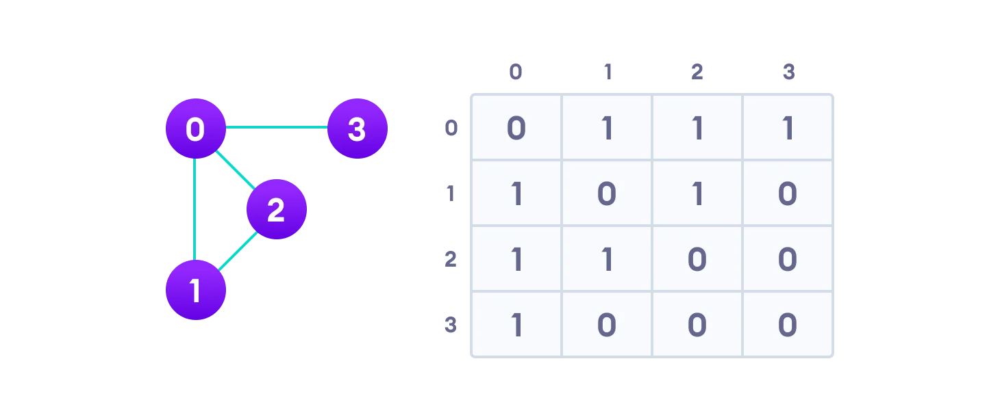
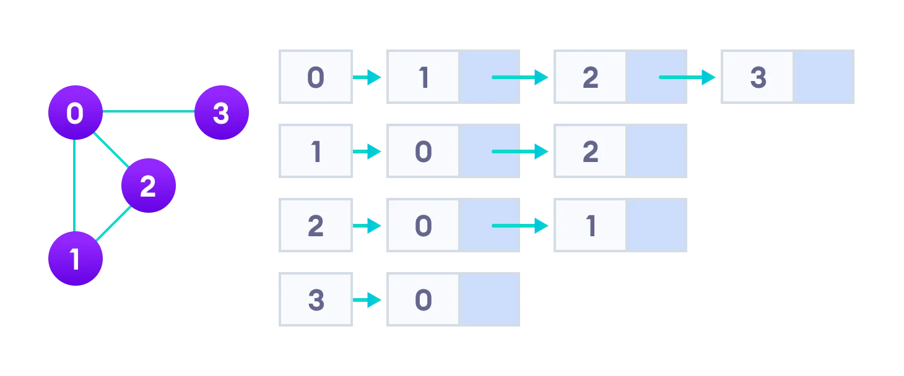

# [Graph Data Stucture](https://www.programiz.com/dsa/graph)

A **Graph** is a non-linear data structure consisting of **vertices** and **edges**. The vertices are sometimes also referred to as **nodes** and the **edges** are lines or arcs that connect any two nodes in the graph. More formally a Graph is composed of a set of `vertices(V)` and a `set of edges(E)`. The graph is denoted by `G(E,V)`.

**Vertices** are the fundamental units of the graph. Sometimes, vertices are also known as vertex or nodes. Every node/vertex can be labeled or unlabelled. **Edges** are drawn or used to connect two nodes of the graph. It can be ordered pair of nodes in a directed graph. Edges can connect any two nodes in any possible way. There are no rules. Sometimes, edges are also known as arcs. Every edge can be labeled/unlabelled.

An **Undirected graph** is a graph in which the edges do not point in any direction (ie. the edges are bidirectional).
A **Connected graph** is a graph in which there is always a path from a vertex to any other vertex.
A **Spanning tree** is a sub-graph of an undirected connected graph, which includes all the vertices of the graph with a minimum possible number of edges. If a vertex is missed, then it is not a spanning tree.
The edges may or may not have weights assigned to them. The total number of spanning trees with n vertices that can be created from a complete graph is equal to `n^(n-2)`. If we have `n = 4`, the maximum number of possible spanning trees is equal to 4^4-2 = 16. Thus, 16 spanning trees can be formed from a complete graph with 4 vertices.

---
Graphs are used to solve many real-life problems. Graphs are used to represent networks. The networks may include paths in a city or telephone network or circuit network. Graphs are also used in social networks like linkedIn, Facebook. For example, in Facebook, each person is represented with a vertex(or node). Each node is a structure and contains information like person id, name, gender, locale etc.

***A graph data structure is a collection of nodes that have data and are connected to other nodes.*** Let's try to understand this through an example. On facebook, everything is a node. That includes User, Photo, Album, Event, Group, Page, Comment, Story, Video, Link, Note...anything that has data is a node.
Every relationship is an edge from one node to another. Whether you post a photo, join a group, like a page, etc., a new edge is created for that relationship. All of facebook is then a collection of these nodes and edges. This is because facebook uses a graph data structure to store its data.

---
[**Graph Representation**](https://www.programiz.com/dsa/graph) 

**Adjacency Matrix** is a 2D array of V x V vertices. Each row and column represent a vertex.
If the value of any element `a[i][j]` is 1, it represents that there is an edge connecting vertex i and vertex j. **Adjacency List** represents a graph as an array of linked lists.
The index of the array represents a vertex and each element in its linked list represents the other vertices that form an edge with the vertex.

---
[**Depth First Search**](https://www.programiz.com/dsa/graph-dfs) 
Depth first Search or Depth first traversal is a recursive algorithm for searching all the vertices of a graph or tree data structure. Traversal means visiting all the nodes of a graph. A standard DFS implementation puts each vertex of the graph into one of two categories i.e **Visited** and **Not Visited**. The purpose of the algorithm is to mark each vertex as visited while avoiding cycles. The time complexity of the DFS algorithm is represented in the form of `O(V + E)`, where `V` is the number of nodes and `E` is the number of edges. The space complexity of the algorithm is `O(V)`.

- Start by putting any one of the graph's vertices on top of a stack.
- Take the top item of the stack and add it to the visited list.
- Create a list of that vertex's adjacent nodes. Add the ones which aren't in the visited list to the top of the stack.
- Keep repeating steps 2 and 3 until the stack is empty.
  

---
[**Breadth First Search**](https://www.programiz.com/dsa/graph-bfs) 
Traversal means visiting all the nodes of a graph. Breadth First Traversal or Breadth First Search is a recursive algorithm for searching all the vertices of a graph or tree data structure. A standard BFS implementation puts each vertex of the graph into one of two categories i.e **Visited** and **Not Visited**. The purpose of the algorithm is to mark each vertex as visited while avoiding cycles. The graph might have two different disconnected parts so to make sure that we cover every vertex, we can also run the BFS algorithm on every node. The time complexity of the BFS algorithm is represented in the form of `O(V + E)`, where V is the number of nodes and E is the number of edges. The space complexity of the algorithm is `O(V)`.

- Start by putting any one of the graph's vertices at the back of a queue.
- Take the front item of the queue and add it to the visited list.
- Create a list of that vertex's adjacent nodes. Add the ones which aren't in the visited list to the back of the queue.
- Keep repeating steps 2 and 3 until the queue is empty.
  

