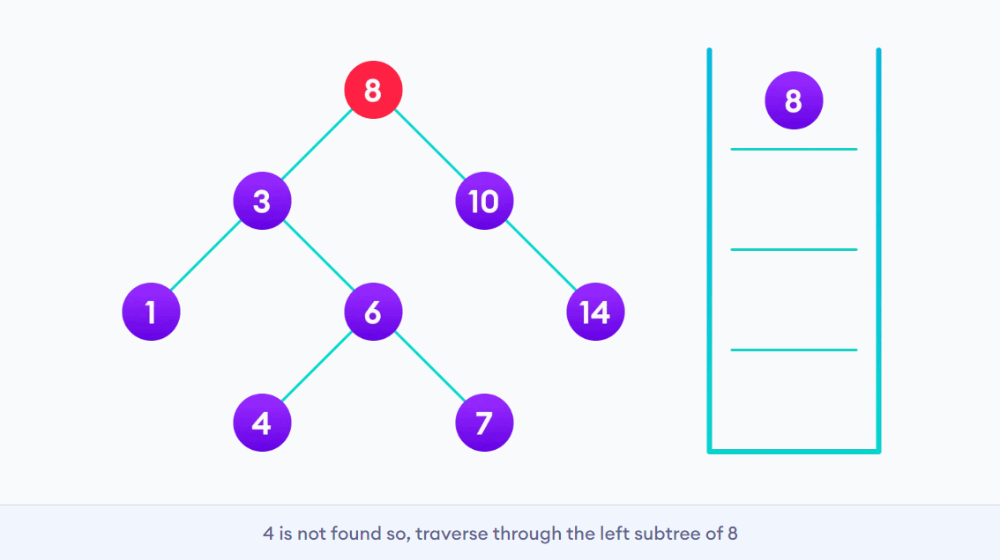
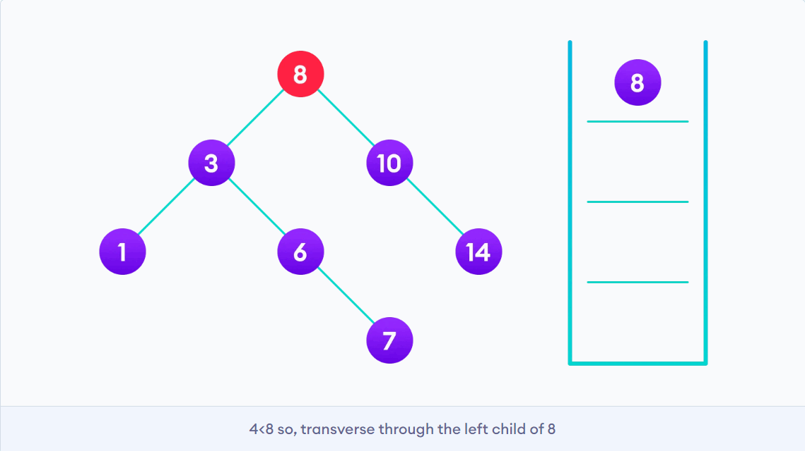
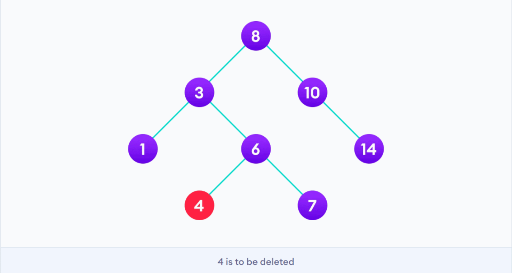
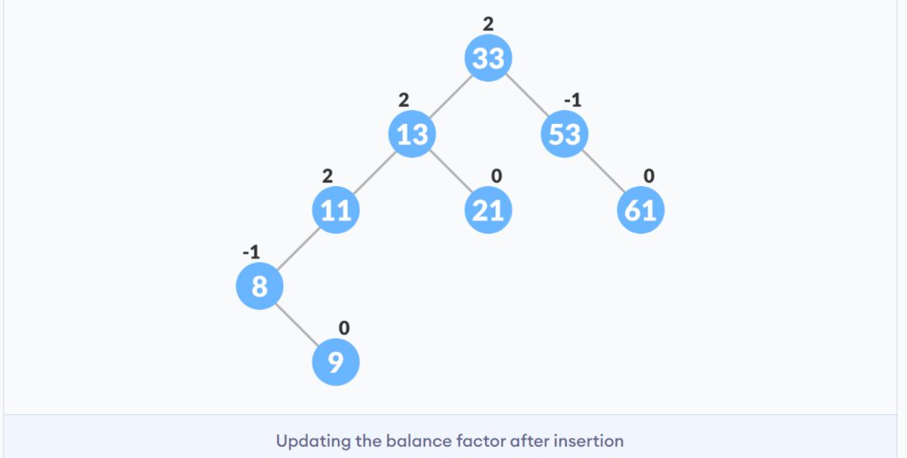
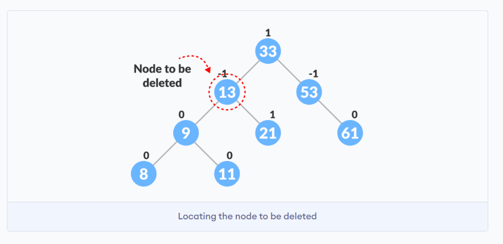
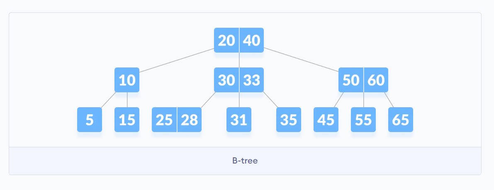

## [Binary Search Tree]()

The algorithm depends on the property of BST that if each left subtree has values below root and each right subtree has values above the root.
If the value is below the root, we can say for sure that the value is not in the right subtree; we need to only search in the left subtree and if the value is above the root, we can say for sure that the value is not in the left subtree; we need to only search in the right sub

[**Search Operation**]()



[**Insertion Operation**]()



[**Deletion Operation**]()



**Binary Search Tree Complexities**
| Operation | Best Case Complexityn | Average Case Complexity | Worst Case Complexity |
| :-------- | :-------------------: | ----------------------: | --------------------: |
| Search    |       O(log n)        |                O(log n) |                  O(n) |
| Insertion |       O(log n)        |                O(log n) |                  O(n) |
| Deletion  |       O(log n)        |                O(log n) |                  O(n) |

---
## [AVL Tree]()
AVL tree is a self-balancing binary search tree in which each node maintains extra information called a balance factor whose value is either -1, 0 or +1. Balance factor of a node in an AVL tree is the difference between the height of the left subtree and that of the right subtree of that node. The self balancing property of an avl tree is maintained by the balance factor. The value of balance factor should always be -1, 0 or +1.
```
Balance Factor = (Height of Left Subtree - Height of Right Subtree) or (Height of Right Subtree - Height of Left Subtree)
```

> ***Most of the BST operations (e.g., search, max, min, insert, delete.. etc) take O(h) time where h is the height of the BST. The cost of these operations may become O(n) for a skewed Binary tree. If we make sure that the height of the tree remains O(log(n)) after every insertion and deletion, then we can guarantee an upper bound of O(log(n)) for all these operations. The height of an AVL tree is always O(log(n)) where n is the number of nodes in the tree.***

[**Inserting a node**]()



[**Deleting a node**]()



**Complexities of Different Operations on an AVL Tree**
| Insertion | Deletion |  Search |
| :-------- | :------: | ------: |
| O(log n   | O(log n  | O(log n |

---
## [B-tree]()

B-tree is a special type of self-balancing search tree in which each node can contain **more than one key and can have more than two children.** It is a generalized form of the binary search tree. It is also known as a height-balanced m-way tree.



> ***The need for B-tree arise with the rise in the need for lesser time in accessing the physical storage media like a hard disk. The secondary storage devices are slower with a larger capacity. There was a need for such types of data structures that minimize the disk accesses. Other data structures such as a binary search tree, avl tree, red-black tree, etc can store only one key in one node. If you have to store a large number of keys, then the height of such trees becomes very large and the access time increases. However, B-tree can store many keys in a single node and can have multiple child nodes. This decreases the height significantly allowing faster disk accesses.***
